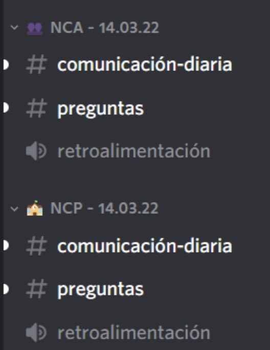
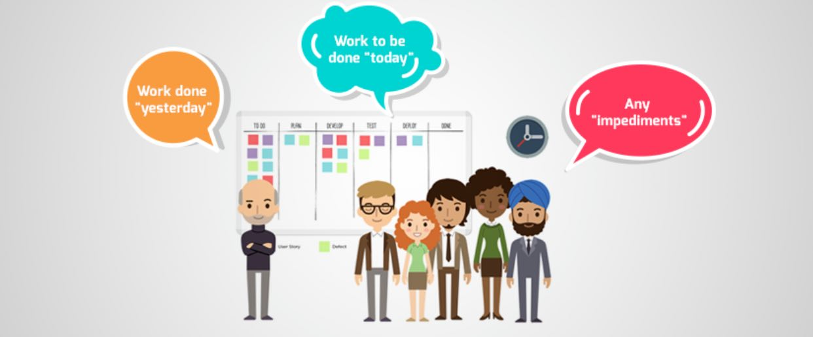

# Case study - Deep dive into NEAR Hispano

NEAR Hispano’s success makes it an interesting case study from which to draw key fundamental principles that can be applied by regional leaders in different contexts. In just a few months, NEAR Hispano managed to train hundreds of people across Spanish speaking countries and spur interest in Web3 and the NEAR Protocol.

In this section, we provide a thorough overview of NEAR Hispano’s first steps, its development, and the processes behind building the courses. We focus on highlighting the processes related to NEAR Hispano, thus touching on outreach campaigns, events, team building and more.

# 1. Coming Up with a Business Model

A business model is critical to the success of any organization. It helps understand  the steps, processes and decisions that are made to generate, deliver, and create value. While this is usually associated with monetary value, it can also relate to social, cultural and other contexts based on the nature of the enterprise. NEAR Hispano is no exception. Through interaction and input from its community, NEAR Hispano developed a business model that can be replicated and adopted by others.

## The product:
NEAR Hispano introduces NEAR Protocol to Spanish speaking countries through education. This is achieved by delivering webinars, courses and certifications. They also support students in creating their own projects, enrolling in residency programs and applying for grants.

NEAR Hispano offers a variety of informative and educational materials that have been either created or translated from other groups including [NEAR Academy](https://near.academy/) and [NEAR Guilds](https://nearguilds.com/)

## The market:
At a high level, the NEAR Hispano target audience are people in Spanish speaking communities. This means that the reach of NEAR Hispano is not restricted to one country or continent. This makes their business model scalable and replicable. At a more granular level, NEAR Hispano targets developers and entrepreneurs.

In keeping with its mission to expand the reach of NEAR Protocol through education, NEAR Hispano focuses its efforts on attracting students and professors from universities in multiple LATAM countries.

 For this initiative to scale, it is critical to train community members that can train newcomers to the ecosystem. As such, NEAR Hispano focuses on attracting and training professors. Comment end  This model helps to grow the community and deliver the business objectives.

## The delivery:
NEAR Hispano reaches its target audience by growing its community rather than by investing in marketing. Unlike a regular enterprise, NEAR Hispano focuses on building relationships with other groups and communities that can help them expand its reach. It works closely with other groups within NEAR Protocol like NEAR University, and its members participate in different activities to spread the word about NEAR Hispano. Many of its members are also successful entrepreneurs that help bring more people to the ecosystem.

By growing its connections across many different LATAM countries, NEAR Hispano reaches universities and delivers webinars to educate professors and students on the opportunities available with NEAR Protocol.

These communities, the courses, and the day to day interactions of the groups are primarily maintained in two platforms: [Discord](https://discordapp.com/channels/855182002981830656/855182002981830663) and [Telegram](https://t.me/NEARHispano).

Their educational activities are delivered by bringing together a group of experts that help put together dynamic and interactive courses, as well as certification programs:
- [Near Certified Developer (NCD)](https://www.near.university/courses/near-certified-developer),
- [Near Certified Analyst (NCA)](https://www.near.university/courses/near-certified-analyst),
- and [Near Certified Professor (NCP)](https://www.youtube.com/watch?v=TQz8n4pSQdk&list=PLixWO0N_iFTMZ9cSaB_b4GnwNmCus-_qVd-professors-near-hispano-d01cb0f4b914).

## The expense:
The costs for running this program are relatively low compared to those of a new startup, which may include:
- Startup costs:
    - Legal fees
    - Office furniture
    - Rent
    - Market research
    - Consultants
    - Signage
    - Startup cash balances
- Ongoing operating expenses:
    - Rent
    - Legal Fees
    - Payroll
    - Marketing and Advertising
    - Supplies
    - Travel Expenses
    - Training

Many of these can be avoided because the work is completed by NEAR Hispano core members, who have dedicated themselves to build this community. In addition, work can be completed remotely without the need to set up offices, purchase equipment, etc. Another considerable expense for any business relates to Marketing and Advertising, which are considerably reduced by leveraging the already existent network of professionals and enthusiasts that surround NEAR Protocol. NEAR Hispano also works closely with NEAR Education and the NEAR Foundation to obtain the funds that are needed to run its operations.

## The value:
In the end, it is critical to ensure that value is generated and to measure it. In the case of NEAR Hispano, value is generated in different ways:
- Spanish speaking people gain access to a technology that seemed unreachable before. They can now further their education and start their own projects.
- NEAR Protocol gains adoption. Hundreds of new users among developers, entrepreneurs and professors become versed on NEAR Protocol and its functionality. These individuals also spread the word and invite others to join the ecosystem.
- NEAR Hispano members and participants are remunerated for their efforts. How much they earn depends on the projects and activities they complete. These funds are obtained through grants offered by the NEAR Foundation.

# 2. Funding Opportunities at NEAR
There is a number of funding opportunities ([NEAR Grants](https://near.org/grants/)) at NEAR that enable community members to launch new projects and help grow the NEAR ecosystem. Not all funding opportunities and grants are the same or serve the same purpose. This is something that NEAR Hispano understands very well and uses to potentialize its program.

NEAR Hispano focuses on creating real use cases that demonstrate its value and justify its need for funding. Their first step when starting an educational program was to create a NEAR Guild. These [Guilds](https://near.org/guilds/), in large part, make up the NEAR ecosystem. They develop new projects and grow the community. Guilds are groups that share a common vision and mission; they are the social force behind the growth of NEAR Protocol. When NEAR Hispano created a Guild ([Start a Guild](https://near.org/start-a-guild/)), they received a small initial budget from NEAR Foundation to run its activities including creating content, organizing webinars and helping future students to set up their NEAR Wallet. Today, NEAR Hispano works closely with NEAR University to develop its educational content. This collaboration opens more doors for grants from NEAR University ([Near University Grants](https://www.near.university/earn/grants)).

The focus is not only on obtaining grants to fund the activities of NEAR Hispano, but mostly on helping community members obtain their own grants and further develop their Web3 careers. As such, NEAR Hispano [mentors and works]() closely with those who complete their courses. By understanding the particular needs of each person, NEAR Hispano mentors help individuals obtain grants that fit their projects and objectives well. One major entryway that NEAR Hispano promotes is helping people to enroll in one of [NEAR’S Education Fellowship programs](https://www.near.university/earn/fellowship):
- Entrepreneur in Residence,
- Developer in Residence,
- Designer in Residence,
- Teacher in Residence,
- Writer in Residence
- or Researcher in Residence.

# 3. Team Building

## Begin with a Core Group of Like-Minded Individuals
Building an effective and cohesive team can be daunting, especially when various skill sets need to be defined and rolled out prior to engaging in a new project. Moreover, given knowledge gaps and individual scheduling/availability, the job of creating a team can seem exponentially more difficult. NEAR Hispano is a testament to the fact that building a team under these circumstances, although challenging, is not an insurmountable task. It is best achieved through shared passion and community engagement.

As the founder of NEAR Hispano, Claudio Cossio was very resourceful in establishing his own team. In the initial phase of his recruitment process, Claudio used his existing network to seek feedback and gauge interest. This approach ensured Claudio was able to reach out to other Spanish speakers in the community with whom he had rapport and common interests.  He established a [NEAR Hispano core group]() with a shared vision (Rosa Maria Orellana, Alejandro Van Beta , Manuel Haro, Juan Manuel Cancino, Rodrigo Moreno, Claudio Cossio, and shortly thereafter Cristian Zambrano, Luz Margarita Saucedo and Christopher Alan Estrada). Claudio believed that a collaborative spirit and the humility to recognize knowledge gaps would enable his team to succeed in outreach and “connect the dots.”

## Use Community Networks to Strengthen and Diversify Talent: Connecting the Dots
As a way of “connecting dots,” Claudio and his team began outreach through their respective networks, connecting with people who had experience in the Web3 industry. This grassroots approach depended on word of mouth and community relationships to build membership. It ensured Claudio’s intent of shared vision and passion. It brought together people in the community with skill sets that strengthen the overall team, adding depth, knowledge, perspective and experience to an already solid foundation.

## Lean into Community and Engage in Reciprocal Collaboration
Building on his initial momentum, Claudio created a NEAR Hispano Guild, which created visibility in the NEAR community and also expanded NEAR Hispano’s access to the support of the greater NEAR community. This support was instrumental in the success of NEAR Hispano and guided Claudio’s approach to community engagement.

Selfless support of others often leads to reciprocity and maintains a tone of care and respect within the community.  This type of relationship building has enabled Claudio to reach talent and engage individuals across languages, borders and time zones.

## Outreach through Relevant and Targeted Community Events
When visibility and community are compounded, they serve to build momentum and outreach in a way that more traditional means of recruitment such as advertising and paid focus groups rarely can. Claudio built on this momentum and visibility in the next phase of his process by hosting community outreach programs such as hackathons, guest speaking at tech events, and webinars for universities that targeted professors, teachers and students.

## Team Up!
Collaborating with other groups within  NEAR, such as NEAR University, enabled NEAR Hispano to further compound skill sets and passion and to expand communication and interest. A commitment to collaborate, support and give back fostered a culture of trust and a community focused on honesty and support.

This foundation of trust allows NEAR Hispano to have a level of vulnerability and humility that ensures teams are effective in their work and willing to be honest and flexible in approach. This serves to reinforce a supportive and collaborative environment.

## Reflect and Strive to Improve Diversity and Inclusion

In addition to trust and collaboration, NEAR Hispano focuses on diversity and inclusion in a meaningful way. Asking key questions and creating safe and accessible learning spaces ensure that diverse talent is reached. NEAR Hispano poses the following questions while conducting outreach:

- Can we bring enough women, LGBTQ2S+ individuals, people with disabilities, and other marginalized people  into the space? Can we really give them an opportunity to excel?
- Can we nurture talent? Can the talent be diverse (arts, finance, agriculture, tourism etc.)?

Asking these questions allows NEAR Hispano to reflect both on success and areas of growth when diversifying its team. In doing so, the team can define new goals and adjust to meet them in an ongoing and meaningful way. A vulnerability and willingness to define areas that need improvement creates both a safe workspace and a more qualified talent pool.

# 4. Course Development

## Recognize Existing Resources and Identify Learner Needs
NEAR Hispano recognized an opportunity to make education more accessible by removing barriers to entry. Translating content into Spanish and creating a student-centered approach to instruction were identified as key success factors. This vision drove the partnership with NEAR University, ensuring an effective collaboration open to adaptation and adjustment based on learner needs. In addition, the strong partnership fostered between NEAR University and NEAR Hispano ensured an avenue for feedback and suggestions regarding course structure and content.

## NEAR Hispano vs NEAR University Courses
NEAR Hispano courses mirror those of NEAR University without noticeable technical differences; what sets them apart is their focus. From the start, NEAR Hispano understood that the focus should be on how the courses are delivered and not so much on changing their content. This meant developing an educational strategy that emphasized designing courses that facilitated an agile approach to course delivery.

### Course Delivery
NEAR Hispano’s courses are designed to promote the interaction between instructors and students. As courses contain new and dense technical content that can be difficult to absorb without the right support system in place, NEAR Hispano uses both synchronous and asynchronous spaces during the certification programs that are offered (NCD, NCA and NCP). The synchronous spaces take place on a daily basis and allow students to bring forward questions related to the course content, while the asynchronous spaces are maintained in the NEAR Hispano’s Discord server. Each course counts with their own Discord channels that offer an opportunity to share ideas and promote the interaction between students; they also offer an avenue to ask questions to instructors, certified developers and other experts involved with NEAR Hispano:

This approach proved to be successful as students benefited from the continuous support by NEAR Hispano to help them navigate the Web3 ecosystem.

### Asynchronous Approach and Agile Delivery
The aforementioned daily sync sessions of the courses follow the concept of a daily stand-up, a ceremony commonly used in [Scrum](https://www.scrumalliance.org/about-scrum) (an Agile framework). These sessions are used to discuss progress at a high level and not to troubleshoot any problems. The goal is to understand how things are going, identify any roadblocks and next steps. This is achieved by asking students the following three questions:

- What did you accomplish since the last session?
- What are you working on until the next meeting?
- What is getting in your way or keeping you from making progress?

The instructor plays the role of a Scrum Master by maintaining the conversation on topic and within the allotted time. This approach ensures that progress is made everyday and that any roadblocks to learning are promptly removed. This way to deliver a program also enables positive engagements between students, facilitates the learning process and promotes ownership of the course by each and everyone of the participants.

Learning is not limited to theoretical learning, but it is also practical. Students, with the support of NEAR Hispano experts, are asked to develop their own projects during the course. This allows them to apply the new knowledge acquired and achieve their learning objectives.

### Post Certification
The NEAR Hispano experience is not limited to providing participants access to courses in their own language, but on supporting them to build their careers in Web3. This is achieved through two key pillars:

**1. Creating spaces for everyone**

No matter what a person goals are, he/she will find a space within the community:
- If you are a developer, there is a space for you.
- If you have a project idea and want to explore it and execute it, there is a space for you.
- If you want to teach, there is a space for you.
- If you want to learn Web3 from scratch, there is a space for you.
This is what makes NEAR Hispanos’s approach to education more special. It’s not just another school, it’s a COMMUNITY.

**2. Building relationships**

A key success factor for any individual that starts a new career or takes on a new challenge is their support network. NEAR Hispano graduates are encouraged to stay in touch and learn that they can count on their peers even after their courses are complete. An example of this is the NEAR Hispano Developers in Residence group, which as of this day still have daily meetings in Discord where they share their progress and ask for feedback.

### Designing the Courses and Involving the Experts

Luz Margarita, a PhD in Education with experience in this field, was invited to join NEAR Hispano to identify areas of improvement based on how courses were being delivered by NEAR University, and to develop an educational approach that could meet the needs of the NEAR Hispano community. As part of her strategy, she enrolled in the NEAR certified developer program, which  allowed her to learn deeply and provide meaningful feedback. Luz was able to learn what they do, and what sessions look like through demos and access to various tools used during the instructions.

The partnership with NEAR University allowed Luz Margarita to tap into resources she knew already existed and in doing so was able to effectively define goals of learning and development. Having a primary goal to translate content into Spanish, whilst tailoring content to align with the needs of the people within the NEAR Hispano ecosystem.

### Complete the Bootcamp - From Expert to Becoming a Web3 Subject Matter Expert

Enrolling in the NEAR University Bootcamp, provided Luz the opportunity to learn how blockchain technology works, and how to use it on a daily basis. Luz gained a greater understanding  about the topic, and was able to create a strategy that could be adapted to promote a deep understanding of NEAR for all NEAR Hispano participants. Luz knew that barriers such as language and unclear pathways, could inhibit access to learning and hinder learner progress:

> “ You cannot do a course from your level of knowledge, you must do it from a level of understanding in which the trainee is encouraged to advance and learn”
>
> Luz Margarita

By combining her understanding of the models of education and user experience, Luz was better able to define an approach that would not simply translate content, but transfer knowledge in a meaningful and user specific way.

### Lean into Your Strengths as an Educator and Know Your Learner
As a next step, Luz applied her extensive background in education to reflect on her own experience in the Bootcamp. Then she applied these insights when developing courses for NEAR Hispano learners. This meant not simply translating the courses into Spanish, but also transiting the delivery in a manner that demystified technical and specific languages, thus removing other barriers to entry. Luz knew that learners are different and have different learning needs. Meeting students where they were at, and planning a specific course delivery based on diverse student needs improved engagement and achievement and ultimately produced more effective instructors.

NEAR Hispano recognized that well defined and contextualized content enabled instructors to become subject matter experts and to in turn become effective instructors facilitating and effective knowledge transfer (an integral component of NEAR Hispano). Luz tapped into the abundant information in the ecosystem and provided a means by which to navigate  information with a clear plan.

### Create Learning Paths that Promote Self-Directed Learning

NEAR Hispano uses learning paths to promote self-guided instruction, while keeping each person accountable to fulfill their individual learning responsibilities. NEAR Hispano maintains that the most important focus of course development is customization reflective of learning needs. Meeting learners where they are at can take several routes, and each route will therefore look quite different. This speaks to why NEAR Hispano’s approach to education is so effective.

Taking the time to understand learner needs, allows instruction to be tailored and specific in a way that is engaging and motivating. Moreover, taking the time to know about a learner's needs builds a rapport, a sense of trust and most importantly the opportunity to reflect and adjust as needed. The end result is empowered learners able to adapt and apply the protocol in a meaningful way, and an instructor who becomes more effective in recognizing and adapting content based on learner needs.

## Day Zero Challenge - From pre-work to work
As part of NEAR Hispano’s commitment to meet learners where they are at, meant adapting how students were introduced to the courses. NEAR University does an excellent job at creating and delivering content that allows participants to build their careers in Web3. Part of this means encouraging participants to also show their commitment by completing work on their own that is required to succeed in the different programs.

This is where the “Day Zero Challenge” comes into play. It is educational material (i.e. videos, readings, etc.) that students must complete on their own before the courses begin. It is estimated that completing the Day Zero Challenge takes approximately 20 hours. This is a good way to provide students with the tools required to succeed in their certifications, but to also know who are those individuals that are really committed to start a career in Web3.

NEAR Hispano recognized the importance of this challenge but at the same time, it understood that it could bear a heavy burden on those individuals that were completely new to Web3 or that had other commitments (i.e. other jobs, projects, etc.). This resulted in students dropping before  the courses started, or during the first days of the courses after realizing that not completing the Day Zero Challenge meant to start far behind the rest of the group. The solution to this problem, which proved to be very successful, was to include the Day Zero Challenge as part of the courses. While students were still responsible for completing the work on their own, they now had the opportunity to do it while being able to ask questions to the instructors and share ideas with their peers.

### Define an Education Process with Clear Stages through an Ongoing Project Development
NEAR Hispano breaks their education process into the following stages, with focus on project development at each stage to ensure participants maintain motivation and enthusiasm:

1. Work with NEAR to visualize what project could be developed, and have some idea of where the project can be applied
2. Develop the project, incorporating additional elements
3. Apply to the Fellowship.
- At each stage, the project is further developed to encourage progress and continued learning

### Learners Become Subject Matter Experts and Facilitators (with hands-on experience)
As each participant completes their projects, they in turn will become facilitators capable of delivering content with the strength of having hands-on experience. Once the learning is completed, participants will get their Fellowship and benefit from ongoing mentorship and support.

This approach allows students to become trainers capable of customizing and delivering course content to other learners in a specialized manner reflective of NEAR Hispano methodologies. This approach also maintains a growth of qualified instructors, from diverse skill sets and backgrounds, capable of delivering course content within the NEAR Hispano framework.

## Getting Started
After the design of NEAR Hispano’s business model, the drafting of funding application, and course development, the first challenge encountered by the team was how to reach people, and communicate the value of their offer:

> “One thing is to develop and run courses, and the other is to find individuals to sell these courses to. Day 0 is critical, and is the most challenging moment because you have to figure out how to attract people to your program and motivate them to participate.”
>
> Claudio

Finding a unique selling proposition (USP) requires a deep understanding of both the context in which you are going to promote your product, the value it delivers to its customers, and the ability to create a sense of urgency.

> “How can you market your product to people? Literally, you make an offer “Hey, here is a cool opportunity, you have the chance to learn today, because in 18 months this learning opportunity will not be here anymore. Today is the time to get engaged, and reap the benefits of being there early. If you come today with your Web2 firm full of devs and get NEAR Certified, we might be able to put you on a project to work on”
>
> Claudio

Creating the first batch of NEAR educators is essential for sustaining your educational program. Without more educators joining your project will not be able to scale and reach full potential. As there is no right formula for attracting motivated individuals to your business, you might have to try out different strategies before finding the right one. After months since inception, NEAR Hispano is still adjusting its strategies for obtaining even better results, paying particular attention to its outreach campaigns and events.

## Conducting Effective Outreach Campaigns
NEAR Hispano conducts strategic outreach campaigns in order to promote its courses. In this section, we provide an overview of the considerations that inform their approach and strategies. In particular, we focus on putting forward concrete advice whose value can be transferred onto your business.

## Tailor Your Strategy to Your Target
When starting your outreach campaign, it is essential that you develop a good understanding of what the person in front of you might want and at the same time have a clear and appealing offer to propose. Universities, for instance, are different from the private sector, therefore a different approach is recommended.

According to Claudio Cossio, while universities might be more willing to invest in the long-term future, the private sector is generally more oriented on achieving short term goals. Changing paradigms always pose a potential risk for businesses, and although your proposition brings innovation to their firm, fear of endangering their work-flow might lead them to pass on the opportunity. To bring in more entrepreneurs, NEAR Hispano focused on organizing events, and hackathons that would give entrepreneurs the opportunity of immediate gains.

Creating opportunities to showcase the benefits of your program, in the form of events, meetups, and hackathons, will enable entrepreneurs to overcome their fears and skepticism. Involving more people from the industry, also makes your proposal acquire tangibility in the eyes of entrepreneurs and help them trust your initiative.

## Start with Low-hanging Fruits
Web3 is still an unknown world to many people. Numerous biased media reports on scams limit understanding of Web3 and often are an impetus for people to turn the other way and decide not to learn about it. In the first stages of your projects you want to start off by engaging those firms and individuals that have already been involved with this technology, or show interest in transitioning toward it. As your resources are not infinite, you need to identify which firms and universities show welcoming attitudes towards Web3 and focus on bringing them onboard first. Those that show interest towards Web3 will be more likely to understand the value of what you are offering them and will be quick to get involved.

## Leverage Your Network
When starting out your outreach campaign it is useful to start off with connecting with  businesses and individuals in your social circle. It makes sense to draw from your existent resources as much as possible and spread the word with people that trust you. Leveraging your network always presents advantages, not only because people you know are more likely to listen and consider your proposal with an open mind but also because they might help you access their own network.

## Be Honest and Clear about Your Goals
The number one rule to win people’s trust is to be honest and crystal clear about your intentions and what interest parties will gain from your program.

> “For me it’s always been about just putting people in the right places at the right time, it's just connecting the dots, that's what I do…I put value on the table and open up doors for people. I think that's first and foremost. The best way of earning people's trust in you, and earning people's trust in partnerships as well .”
>
> Claudio

While you need to make sure that you adapt your communication to the person in front of you, you also want to set clear expectations.You should be as detailed as possible in regards to  what the opportunities are, how funding works, and what they can expect once they finish the course.

## Final product
<insert-an-infographic>
- 1 NEAR Certified Instructor (!!) trained 300 students (10 instructors could have trained 3000 students)
- 7 team members
- 9 month into this business (started 9 month ago)
- Over 600 students enrolled to the course
- Over 100 developers got certified (NCD)
- 8 certified teams received a grant ( 3 on NEAR Mainnet, 5 in development)
- Over 250k USD received in grants from NEAR Foundation in total over 9 months
